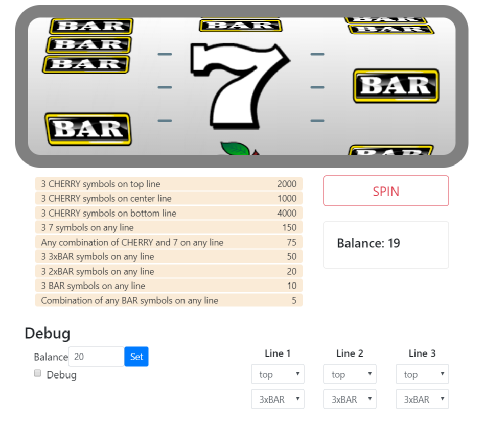

# Slots Game
## Test Assignment
### Author: Giorgi Khundzakishvili

## Introduction

There are 3 reels on screen, 3 position on each reel.
5 different symbols are applied on each reel. 
Winning combinations are present below screen, on pay-table.
Spin button and balance are present next to pay-table. 
Player starts with balance equal to 20 coins.
User clicks Spin button to start a game.  
Spin button starts rotating reels.
reels stop from left to right.
After rotation finishes, winning rows are crossed on screen and winning combinations are highlighted on pay-table.

## Logic
- Reel stops only at 3 positions: top, middle, bottom.
- Every reel has symbols applied in same order.
- Every reel rotates in the same direction.
- Spin costs 1 coin.
- After spin finishes, game combines all winning combinations and adds to the balance.
- If Balance is 0, Spin button is disabled.
- User cannot interact with game while reels are spinning.
- User can set desired balance manually from debug section.
- User can Turn on Debug mode and apply desired symbols on desired positions.
- User can set position and symbol for each reel separately.

## System Requirements

All the required files are placed in project
Only requirement for running the game is Chrome browser.  
index.html is the main file which can be launched in browser.

## Additional details

- Game is designed using given specifications.
- Project is done in given time period, during free time.
- Project is developed from scratch, without additional libraries (only jQuery for DOM manipulations).
- Game is created for demonstration purposes only.
